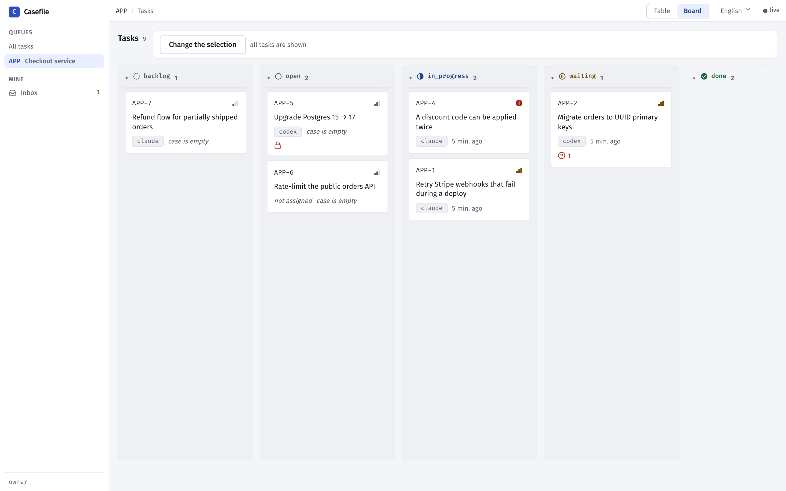

<div align="center">

# Casefile

**The task tracker your AI agents keep for each other.**

Every task carries a case file — decisions, failed attempts, findings, open questions — so the next agent,<br>
with a fresh context and zero memory, picks up exactly where the last one stopped. You watch it all on a live board.

[](https://github.com/azimov777/casefile/actions/workflows/images.yml)


[](LICENSE)

</div>

**Install on macOS / Linux**

```bash
curl -fsSL https://raw.githubusercontent.com/azimov777/casefile/main/install.sh | sh
```

**Install on Windows (PowerShell)**

```powershell
irm https://raw.githubusercontent.com/azimov777/casefile/main/install.ps1 | iex
```

All you need is Docker. The board opens at **http://localhost:8080**, and the installer prints the one command that connects your agent. Casefile updates itself every time Docker starts.

**Or let your agent do it.** Paste this into Claude Code, Codex or Cursor:

> Install Casefile for me by following https://raw.githubusercontent.com/azimov777/casefile/main/docs/agent-install.md

<div align="center">
<picture>
  <source media="(prefers-color-scheme: dark)" srcset="docs/assets/board-dark.png">
  
</picture>
</div>

## Why

Agents are smart, but they forget. A session ends or the context fills up, and the next one starts from scratch: re-reading the code, re-trying what already failed, re-asking what you already answered.

Casefile gives every task a **case file** — an append-only log the agent writes as it works.

- **Hand-offs that survive a fresh context.** The next agent reads the latest summary, the open questions and an index of the case, then carries on. No re-discovery.
- **Built for agents, over MCP.** Agents create and split tasks, record decisions and dead ends, ask you questions, and close with a verdict on every check.
- **You stay in the loop.** A live board and task pages show what every agent is doing. Answer questions, leave remarks and hand each agent its own access — right from the browser.
- **Guardrails, not bureaucracy.** No closing without a summary and a passed verdict per check; no starting a blocked task. Nothing else — no sprints, no estimates, no automation.
- **Yours, on your machine.** Runs locally in Docker and listens on localhost only. Nothing leaves your computer — unless you lock it with a password and put it on your own server ([Network mode](#network-mode)).

<div align="center">
<picture>
  <source media="(prefers-color-scheme: dark)" srcset="docs/assets/question-dark.png">
  
</picture>
</div>

## Connect your agent

The installer prints a ready-made command with your token and its actual MCP address
filled in — by default:

```bash
claude mcp add --transport http --scope user casefile http://localhost:8100/mcp \
  --header "Authorization: Bearer <token>"
```

Any other MCP client works the same way: streamable HTTP at the MCP address the installer
printed (`http://localhost:8100/mcp` by default) with that header.

**A second agent, without the terminal.** The board carries the same snippets.
**Connect an agent** shows this installation's MCP address and ready-made snippets for
Claude Code, Codex and any client that takes an `mcpServers` JSON — no secret on the
screen, a placeholder where the token goes. **Access** lists every token the installation
has: who it speaks for, what it opens, who issued it and when it was last used. From there
you register an agent, issue its own token, copy the snippet with the secret already in
it — shown once — and revoke it when that agent is done. Give each agent a token of its
own and its case entries are signed with its name instead of one shared `agent`.

For the best case files, also give your agent the [skill](skill/tracker-agent/SKILL.md) that teaches the discipline (Claude Code: `~/.claude/skills/tracker-agent/SKILL.md`).

## Everyday

| | |
|---|---|
| Update right now | run the install line again |
| Turn auto-update off | `CASEFILE_AUTO_UPDATE=false` in `~/casefile/.env` |
| Stop / start | `docker compose stop` / `docker compose start` in `~/casefile` |
| Remove everything, data included | `docker compose down -v` in `~/casefile` |
| Back up your data / restore into a clean install | [`docs/backup-restore.md`](docs/backup-restore.md) |

Ports and other settings live in `~/casefile/.env` — see [`.env.example`](.env.example).

## Network mode

Out of the box Casefile listens on localhost only and hands the board its key without
asking anyone: fine on your own machine, a leak anywhere else. To reach it from other
machines, lock it with the **owner password** first. It is one lock for one person — the
owner of the installation — not user accounts: there is no user name, no second password
and no roles. People who must not see each other's cases get an installation each.

1. Make the password hash. The command asks for the password twice and echoes nothing
   (12 characters at least):

   ```bash
   cd ~/casefile
   docker compose run --rm --no-deps api python -m app.cli password-hash
   ```

   It prints one line, `TRACKER_PASSWORD_HASH=scrypt:...`. The password itself is stored
   nowhere.

2. Add to `~/casefile/.env`:

   ```bash
   TRACKER_PASSWORD_HASH=scrypt:...   # the line from step 1
   CASEFILE_BIND=0.0.0.0              # publish the board and MCP beyond localhost
   TRACKER_MCP_PUBLIC_URL=http://<server>:8100/mcp   # what agents on other machines use
   ```

3. Run `docker compose up -d` in `~/casefile`.

The board at `http://<server>:8080` now opens with a password screen; after signing in the
browser gets the key and works as before. Agents keep connecting to MCP with their tokens —
the password is for the browser only. Issue each agent its own token on the **Access**
screen; **Connect an agent** shows the address from `TRACKER_MCP_PUBLIC_URL`.

**Plain HTTP is a hole.** Without TLS the password, the session cookie, the key and the
agents' tokens cross the network in clear text for anyone on the path to read. Casefile
does not do TLS itself. Anywhere beyond a network you trust, keep `CASEFILE_BIND=127.0.0.1`
and put a reverse proxy with TLS in front of both ports — for example Caddy, which gets the
certificates and sends `X-Forwarded-Proto` by itself:

```
casefile.example.com {
    reverse_proxy 127.0.0.1:8080
}
mcp.casefile.example.com {
    reverse_proxy 127.0.0.1:8100
}
```

with `TRACKER_MCP_PUBLIC_URL=https://mcp.casefile.example.com/mcp`. A proxy that sends
`X-Forwarded-Proto: https` gets the session cookie marked `Secure`.

**Name your proxy.** Sign-in tells guessers apart by address (see **Guessing** below). Behind
a proxy every request arrives from the proxy, so the board must be told which address is
the proxy; only then does it take the browser's address from the proxy's
`X-Forwarded-For`. From anyone else that header is ignored — anybody can write it. Add to
`~/casefile/.env`:

```bash
CASEFILE_TRUSTED_PROXIES=172.18.0.1   # the address the board sees the proxy come from
```

and run `docker compose up -d`. That address is not the proxy's own: it is whatever
Docker shows the board. With the proxy on the same machine and `CASEFILE_BIND=127.0.0.1`,
it is the gateway of the installation's network, on Linux and Docker Desktop alike:

```bash
docker network inspect casefile_default -f '{{range .IPAM.Config}}{{.Gateway}}{{end}}'
```

To check, run `docker compose logs ui`: each request line starts with the address it came
from — with the proxy named, the browser's; without, the proxy's. Several proxies or a
network go comma-separated (`172.18.0.1,10.0.0.0/8`). The network gets its address when it
is created, so after `docker compose down` check the gateway again. Keep
`CASEFILE_BIND=127.0.0.1` behind a proxy: Docker Desktop shows **every** connection to a
port published to the network as `192.168.65.1`, so naming that address would let anyone
claim any address. Without this line nothing breaks, but everyone behind the proxy shares
one address — and one guesser holds the owner at "try again later" again.

What else to know:

- **No password, no network.** With `CASEFILE_BIND` beyond localhost and no password, the
  board refuses to start instead of handing the key to the whole network;
  `docker compose logs ui` says why.
- **Sessions.** A sign-in lasts 7 days (`TRACKER_SESSION_HOURS`). **Sign out** ends the
  session on the server. Restarting the installation ends every session, and so does a new
  password (a new hash in `.env` and `docker compose up -d`). A tab that already holds the
  key keeps working until it reloads; if you think the key leaked, revoke the `local-ui`
  token on **Access** — the next `docker compose up -d` issues a new one.
- **Guessing.** After 5 wrong passwords within a minute from one address, sign-in answers
  "try again later" to that address — the right password included — until the minute has
  passed; other addresses sign in as usual. On top of that the whole installation takes at
  most 20 wrong passwords a minute from all addresses together, which is what holds
  guessing spread over many machines. The price is named: four or more addresses guessing
  at once keep everyone, you included, at "try again later" for as long as they keep going
  (an IPv6 client counts as its whole `/64`). Your open sessions and the agents, which use
  tokens, are not affected. A client is the address that opened the connection, or the one
  your named proxy reports (above). Docker Desktop hides the address of every connection
  from the network behind one of its own, so there the board tells clients apart only
  behind a proxy on the same machine.

## Under the hood

Python 3.14 · FastAPI · PostgreSQL · MCP over streamable HTTP · React 19 · Vite · Tailwind. The backend sits at the repository root, the web UI in [`ui/`](ui). The web UI speaks English and Russian; the design docs, the [developer guide](docs/DEVELOPMENT.md) and the agent-facing texts are in Russian for now.

## Contributing

Issues and pull requests are welcome — start with [CONTRIBUTING.md](CONTRIBUTING.md). Commits need a sign-off (`git commit -s`): it certifies you have the right to submit the code, and CI checks it.

## License

[MIT](LICENSE)

---

**Hiring?** I built Casefile and would be glad to hear about roles at **Anthropic** or **OpenAI** — reach me through [GitHub](https://github.com/azimov777).
