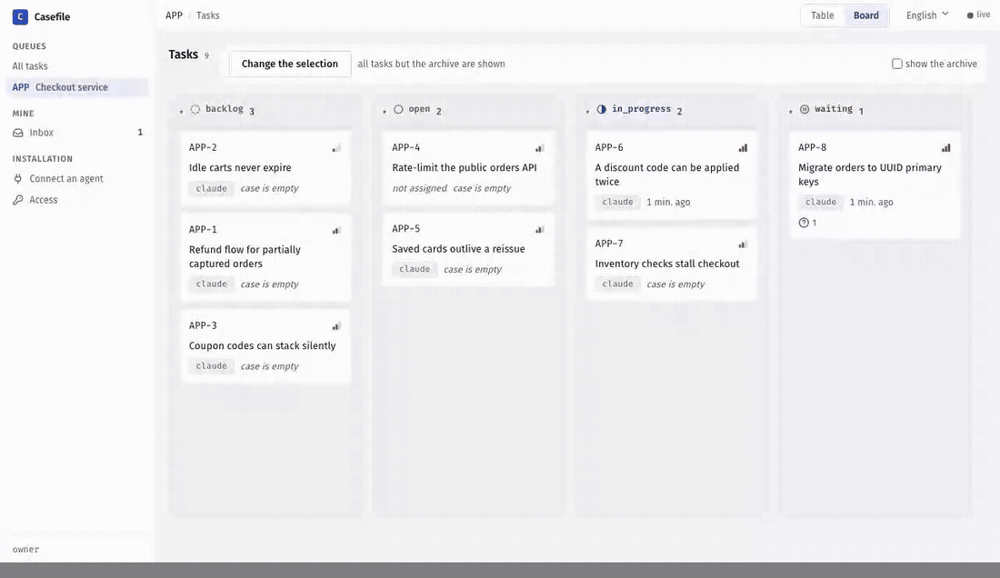
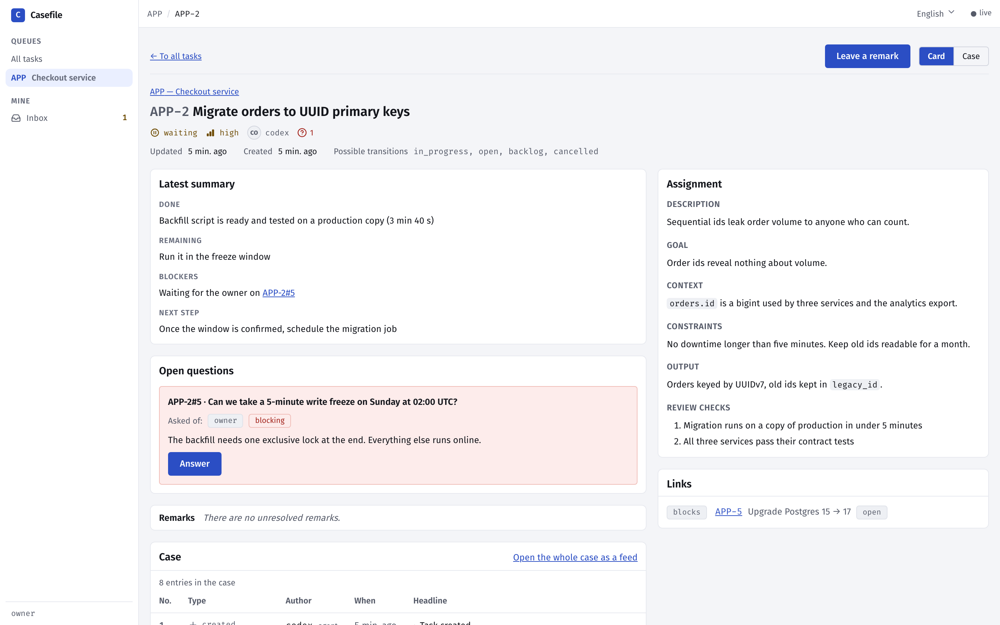

<div align="center">

# Casefile

**The task tracker your AI agents keep for each other.**

AI agents forget everything between sessions. Casefile gives every task a case file —<br>
decisions, failed attempts, findings, open questions — so the next agent picks up exactly where the last one stopped.<br>
You watch a live board and answer their questions.

[](https://github.com/azimov777/casefile/actions/workflows/images.yml)


[](LICENSE)
[](https://glama.ai/mcp/servers/azimov777/casefile)

</div>

**For anyone whose agents work on tasks longer than one session.** A self-hosted MCP server and a web board, free and MIT-licensed. Made for Claude Code; Codex, Cursor and any other MCP client connect the same way.

**Install on macOS / Linux**

```bash
curl -fsSL https://raw.githubusercontent.com/azimov777/casefile/main/install.sh | sh
```

**Install on Windows (PowerShell)**

```powershell
irm https://raw.githubusercontent.com/azimov777/casefile/main/install.ps1 | iex
```

All you need is Docker. The board opens at **http://localhost:8080**, and the installer prints the one command that connects your agent. Casefile updates itself to each new release: it checks once an hour and whenever Docker starts.

**Or let your agent do it.** Paste this into Claude Code, Codex or Cursor:

> Install Casefile for me by following https://raw.githubusercontent.com/azimov777/casefile/main/docs/agent-install.md

<div align="center">
<picture>
  <source media="(prefers-color-scheme: dark)" srcset="docs/assets/demo-dark.gif">
  
</picture>
</div>

## Why

A session ends or the context fills up, and the next agent starts from scratch: re-reading the code, re-trying what already failed, re-asking what you already answered.

Casefile gives every task a **case file** — an append-only log the agent writes as it works.

- **Hand-offs that survive a fresh context.** The next agent reads the latest summary, the open questions and an index of the case, then carries on. No re-discovery.
- **Built for agents, over MCP.** Agents create and split tasks, record decisions and dead ends, ask you questions, and close with a verdict on every check.
- **You stay in the loop.** A live board and task pages show what every agent is doing. Answer questions, leave remarks and hand each agent its own access — right from the browser.
- **Guardrails, not bureaucracy.** No closing without a summary and a passed verdict per check; no starting a blocked task. Nothing else — no sprints, no estimates, no automation.
- **Yours, on your machine.** Runs locally in Docker and listens on localhost only. Nothing leaves your computer — unless you turn on sign-in and put it on your own server for your team ([Network mode](#network-mode)).

<div align="center">
<picture>
  <source media="(prefers-color-scheme: dark)" srcset="docs/assets/question-dark.png">
  
</picture>
</div>

## How it's different

- **Not a notes file.** A `CLAUDE.md` or `handoff.md` gets overwritten: the attempt that failed two days ago disappears, and two sessions edit the same file. A case file is append-only — a correction is a new entry that points at the old one. Keep `CLAUDE.md` for per-repo rules; Casefile is per task.
- **Not a memory server.** Memory MCPs recall facts by similarity. Casefile recalls nothing clever: it is a work log per task, read in a fixed order — card, latest summary, open questions, index, then only the entries you need.
- **Not an issue tracker with MCP bolted on.** An issue is a description and a thread anyone can edit. Case entries are typed and never edited, and the tracker refuses writes that would break the record.
- **Not an orchestrator.** It never starts agents, runs timers or moves tasks by itself. Handing out work and noticing a dead session stay with you and your agent harness.

## Connect your agent

The installer prints a ready-made command with your token and its actual MCP address
filled in — by default:

```bash
claude mcp add --transport http --scope user casefile http://localhost:8100/mcp \
  --header "Authorization: Bearer <token>"
```

Any other MCP client works the same way: streamable HTTP at the MCP address the installer
printed (`http://localhost:8100/mcp` by default) with that header. Clients that take an
`mcpServers` JSON (Cursor, VS Code and others) use this — fill in your token and, if your
installer printed a different address, that address instead:

```json
{
  "mcpServers": {
    "casefile": {
      "type": "http",
      "url": "http://localhost:8100/mcp",
      "headers": {
        "Authorization": "Bearer <token>"
      }
    }
  }
}
```

**Over stdio, as an alternative.** Streamable HTTP above is the main way in. A client
that can only launch a command and talk to it over stdin/stdout gets the same server
that way: it starts a short-lived container of your installation, attached to the
installation's database — same tools, same token, same case. The token goes in the
client's environment, not on the command line:

```bash
claude mcp add --scope user casefile-stdio --env TRACKER_MCP_TOKEN=<token> -- \
  docker compose -f ~/casefile/docker-compose.prod.yml run --rm --no-deps -T \
  -e TRACKER_MCP_TOKEN mcp python -m app.mcp --stdio
```

The installation has to be up: the stdio process brings no database of its own. Each
client session is a process of its own, so HTTP stays the lighter choice wherever the
client supports it. An installation image older than the stdio mode answers
`unrecognized arguments: --stdio` — update it first.

**A second agent, without the terminal.** The board carries the same snippets.
**Connect an agent** shows this installation's MCP address and ready-made snippets for
Claude Code, Codex and any client that takes an `mcpServers` JSON — no secret on the
screen, a placeholder where the token goes. **Access** lists your tokens — every token
of the installation, if you are an administrator: who it speaks for, what it opens, who
issued it and when it was last used. From there
you register an agent, issue its own token, copy the snippet with the secret already in
it — shown once — and revoke it when that agent is done. Give each agent a token of its
own and its case entries are signed with its name instead of one shared `agent`. On a
shared installation every person does this for their own agents, without the
administrator, and sees and revokes only the tokens they issued or that speak for them.

## Tools

Every MCP tool a `task` or `main` token opens, grouped by area (`app/mcp/tools/`):

**Tasks**
- `get_task` — returns everything about one task in a single call: card, parent and children, links, computed features, latest summary, open questions, unresolved remarks, case index and transition targets
- `search_tasks` — searches tasks by a query-language string, by separate conditions, or by both
- `create_task` — creates a task in `backlog`, optionally as a child of a parent task
- `update_task` — changes the given fields of a task; fields left out stay as they are
- `transition` — moves a task to another status along the fixed transition table
- `close_task` — closes a task: files entries, verdicts and the final summary and moves it to `done`, in one transaction

**Case**
- `read_entries` — returns entry bodies of one task's case, with payload, in number order
- `add_summary` — files a summary: the handover note of a case, in four parts
- `add_entry` — files an entry without payload: a decision, attempt, finding, artifact, remark or note
- `ask` — files a question to registry participants
- `answer` — answers a question of the same task
- `resolve` — resolves a remark on a task: its outcome and where the work went
- `add_verdict` — files the outcome of one review check
- `read_project_entries` — returns entry bodies of one project's case, with payload, in number order
- `add_project_entry` — files a decision, finding, artifact or note in a project's case

**Links**
- `link` — links two tasks and files `link_added` in both cases
- `unlink` — removes a link and files `link_removed` in both cases

**Projects & participants**
- `get_project` — returns one project by its key: key, title, description, current attribute values and the index of its case
- `list_projects` — lists the installation's projects: key and title
- `list_participants` — lists the participant registry: the possible addressees of a question
- `create_project` — creates a project (`main` token only)
- `update_project` — changes a project's title and description, recording each change in its case (`main` token only)
- `archive_project` — archives a project with a reason, freezing it and its tasks against changes (`main` token only)
- `restore_project` — restores an archived project with a reason (`main` token only)
- `set_attribute` — sets the value of a project attribute, creating it or changing it with a reason; the history stays in the project's case
- `remove_attribute` — removes a project attribute with a reason, filing its last value in the project's case
- `register_participant` — registers a human or a permanent agent (`main` token only)
- `update_participant` — changes a participant's description (`main` token only)

**Journal**
- `wait_journal` — returns journal entries after a sequence number, waiting for new ones

## Everyday

| | |
|---|---|
| Update right now | run the install line again |
| Turn auto-update off | `CASEFILE_AUTO_UPDATE=false` in `~/casefile/.env` |
| Stay on one release | `CASEFILE_VERSION=0.3.1` in `~/casefile/.env` |
| Stop / start | `docker compose stop` / `docker compose start` in `~/casefile` |
| Remove everything, data included | `docker compose down -v` in `~/casefile` |
| Move to another machine or your own server | [`docs/moving.md`](docs/moving.md) |
| Back up your data / restore into a clean install | [`docs/backup-restore.md`](docs/backup-restore.md) |

Ports and other settings live in `~/casefile/.env` — see [`.env.example`](.env.example).

### Updates

A new version of Casefile is a release: a git tag `vX.Y.Z` with its images on ghcr.io
under the version and under the `stable` channel. Every installation follows `stable`
by default. It checks when Docker starts and then once an hour, at a slightly random
minute, so a release reaches it within about an hour and ten minutes, with nothing to
restart. Commits to `main` without a tag never reach an installation. The update
recreates the Casefile containers and keeps your data in its volumes. An agent in the
middle of an MCP call when that happens gets a dropped connection and has to retry.

The first release on this channel was 0.2.0. An installation from before it (on
`latest`) moves to `stable` by itself the next time Docker starts, and from then on
checks every hour. A release can also bring a new updater: the update to that release is
still done by the old one, which is then replaced by itself, so what a new updater adds
(such as the rollback below, new in 0.3.0) covers updates from the next release on. If you set
`CASEFILE_VERSION=latest` in `.env` yourself, remove the line to follow releases.

`CASEFILE_UPDATE_INTERVAL` sets how often to check (hours, or `30m`; `0` means only
when Docker starts). If a release fails to start, the installation goes back to the
version it ran before and does not try that release again; the next release is installed
as usual. `docker compose logs updater` tells what happened.

A release that changes the database schema costs one more step. Before installing it,
the updater takes a snapshot of the database (`pg_dump -Fc`, the same format as
[backup and restore](docs/backup-restore.md)). The snapshot stays inside the updater
container, at `/tmp/casefile-before-update.dump`, and takes about as much space as a
manual backup. If that release then fails to start after changing the schema, the
database goes back to the snapshot before the previous version starts again. So the
schema and the data are exactly as they were before the update, and a manual
`docker compose up -d` works as usual. The price: **anything written between the
snapshot and the rollback is lost.** That window is the failed start, up to a few
minutes. While the new version is being brought up, the old one keeps answering for a
few seconds. The snapshot is deleted once the update succeeds or the database is
restored. If the snapshot cannot be taken, that release is not installed this time. If
it cannot be restored, the previous version runs on the new schema, the snapshot is kept,
and the log says how to copy it out.

## Network mode

Out of the box Casefile listens on localhost only, and you type nothing: the installation
creates an administrator account for you (`owner@localhost`) and the board signs into it
by itself. To reach it from other machines, turn on **sign-in**: then everyone signs in
with their own email and password, and every entry is signed by the person who made it.
It is one team per installation — everyone signed in sees every task. The only role is
the **administrator** flag, and all it opens is managing people.

1. Add to `~/casefile/.env`:

   ```bash
   CASEFILE_LOGIN=password            # everyone signs in with email and password
   CASEFILE_BIND=0.0.0.0              # publish the board and MCP beyond localhost
   TRACKER_MCP_PUBLIC_URL=http://<server>:8100/mcp   # what agents on other machines use
   ```

2. Run `docker compose up -d` in `~/casefile`.

3. Give yourself a password. The administrator account the installation made has none;
   this prints a generated one, once:

   ```bash
   docker compose run --rm api python -m app.cli account-password --email owner@localhost
   ```

   Add `--set-password` to type your own instead (12 characters at least, asked twice,
   no echo). Your email can be changed too:
   `account-update --email owner@localhost --new-email you@example.com`.

4. Add your teammates — on the board, or on the server:

   ```bash
   docker compose run --rm api python -m app.cli account-create --email alice@example.com --name alice
   ```

   It prints Alice's password once; hand it to her. `--admin` makes her an administrator
   too. `account-list` shows everyone, `account-update --disable` locks a person out and
   revokes every token they hold or issued to their agents (their past entries stay
   signed with their name), and
   `account-password` resets a forgotten password. Casefile sends no mail: there is no
   address confirmation and no reset link.

The board at `http://<server>:8080` now opens with a sign-in screen. Agents keep
connecting to MCP with their tokens — sign-in is for people in the browser. Issue each
agent its own token on the **Access** screen; **Connect an agent** shows the address from
`TRACKER_MCP_PUBLIC_URL`.

**Coming from the owner password.** An installation locked with `TRACKER_PASSWORD_HASH`
before accounts existed keeps working after the update: sign-in turns on by itself, and
the old password becomes the password of the administrator account `owner@localhost` —
sign in with that email and the same password. The hash in `.env` is no lock any more; it
is only carried over once, and a password you set later is never overwritten by it.

**Plain HTTP is a hole.** Without TLS the passwords, the session cookies, the keys and
the agents' tokens cross the network in clear text for anyone on the path to read. Casefile
does not do TLS itself. Anywhere beyond a network you trust, keep `CASEFILE_BIND=127.0.0.1`
and put a reverse proxy with TLS in front of both ports — for example Caddy, which gets the
certificates and sends `X-Forwarded-Proto` by itself:

```
casefile.example.com {
    reverse_proxy 127.0.0.1:8080
}
mcp.casefile.example.com {
    reverse_proxy 127.0.0.1:8100
}
```

with `TRACKER_MCP_PUBLIC_URL=https://mcp.casefile.example.com/mcp`. A proxy that sends
`X-Forwarded-Proto: https` gets the session cookie marked `Secure`.

**Name your proxy.** Sign-in tells guessers apart by address (see **Guessing** below). Behind
a proxy every request arrives from the proxy, so the board must be told which address is
the proxy; only then does it take the browser's address from the proxy's
`X-Forwarded-For`. From anyone else that header is ignored — anybody can write it. Add to
`~/casefile/.env`:

```bash
CASEFILE_TRUSTED_PROXIES=172.18.0.1   # the address the board sees the proxy come from
```

and run `docker compose up -d`. That address is not the proxy's own: it is whatever
Docker shows the board. With the proxy on the same machine and `CASEFILE_BIND=127.0.0.1`,
it is the gateway of the installation's network, on Linux and Docker Desktop alike:

```bash
docker network inspect casefile_default -f '{{range .IPAM.Config}}{{.Gateway}}{{end}}'
```

To check, run `docker compose logs ui`: each request line starts with the address it came
from — with the proxy named, the browser's; without, the proxy's. Several proxies or a
network go comma-separated (`172.18.0.1,10.0.0.0/8`). The network gets its address when it
is created, so after `docker compose down` check the gateway again. Keep
`CASEFILE_BIND=127.0.0.1` behind a proxy: Docker Desktop shows **every** connection to a
port published to the network as `192.168.65.1`, so naming that address would let anyone
claim any address. Without this line nothing breaks, but everyone behind the proxy shares
one address — and one guesser holds everybody at "try again later" again.

What else to know:

- **No sign-in, no network.** With `CASEFILE_BIND` beyond localhost and sign-in off, the
  board refuses to start instead of handing the administrator key to the whole network;
  `docker compose logs ui` says why.
- **Sessions.** A sign-in lasts 7 days (`TRACKER_SESSION_HOURS`). A session is a token
  with a deadline, kept in the database: restarting the installation does not end it.
  **Sign out** revokes it at once, a changed or reset password ends the person's other
  sessions, and disabling an account revokes all its tokens, the ones the person issued
  to their agents included: enabling it again brings none of them back.
- **Guessing.** Wrong passwords are counted per address and per email, within a minute.
  After 5 from one address, sign-in answers "try again later" to that address — the right
  password included — until the minute has passed; after 5 for one email, from wherever
  they come, that email waits the same way. Other people sign in as usual. On top of that
  the whole installation takes at most 100 wrong passwords a minute, to keep guessing
  from burning the processor; guessing spread over many addresses and many emails that
  reaches it keeps everyone at "try again later" for as long as it goes on (an IPv6
  client counts as its whole `/64`). Open sessions and the agents, which use tokens, are
  not affected. A client is the address that opened the connection, or the one your
  named proxy reports (above). Docker Desktop hides the address of every connection from
  the network behind one of its own, so there the board tells clients apart only behind
  a proxy on the same machine.

## Under the hood

Python 3.14 · FastAPI · PostgreSQL · MCP over streamable HTTP · React 19 · Vite · Tailwind. The backend sits at the repository root, the web UI in [`ui/`](ui). The web UI speaks English and Russian; the design docs, the [developer guide](docs/DEVELOPMENT.md) and the agent-facing texts are in Russian for now.

## Contributing

Issues and pull requests are welcome — start with [CONTRIBUTING.md](CONTRIBUTING.md). Commits need a sign-off (`git commit -s`): it certifies you have the right to submit the code, and CI checks it.

## License

[MIT](LICENSE)

---

**Hiring?** I built Casefile and would be glad to hear about roles at **Anthropic** or **OpenAI** — reach me through [GitHub](https://github.com/azimov777).
